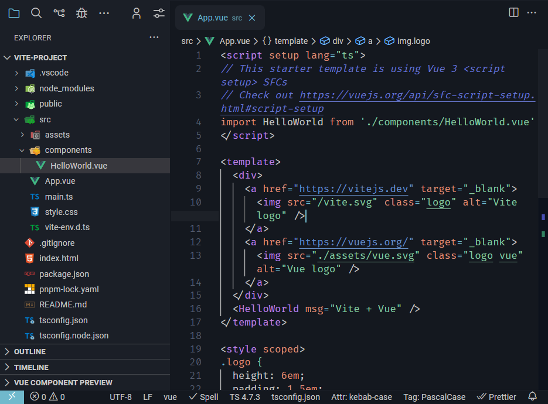

# BlackRock Theme

## Description

BlackRock is my personal theme for vscode with <strong>Dark Blue</strong> Color for the <strong>background</strong> and <strong>sidebar</strong> and <strong>pastel colors</strong> for <strong>syntax highlight.</strong>

## The Theme

I use the fabulous [Nebula Oni Theme](https://github.com/psudo-dev/nebula-oni-theme) for a really long time and I decided to customize more of the theme to my liking.

I prefer darkish backgrounds so when dumpster diving the github repos I found the awesome [AestheticStuff](https://github.com/rxyhn/AestheticStuff) with really darkish colors but more greenish.

So I decided to create my own theme with these two inspirations, using a more blueish dark color for the background and the color scheme of [Jan Leigh dotfiles](https://github.com/janleigh/dotfiles) for a more pastel and calm looking instead of the vivid colors of the <strong>Nebula Oni</strong>

**Enjoy!**

## Acknowledgements

My main Inspirations

* [Jan Leigh](https://github.com/janleigh/dotfiles)
* [Nebula Oni](https://github.com/psudo-dev/nebula-oni-theme)
* [AestheticStuff](https://github.com/rxyhn/AestheticStuff)